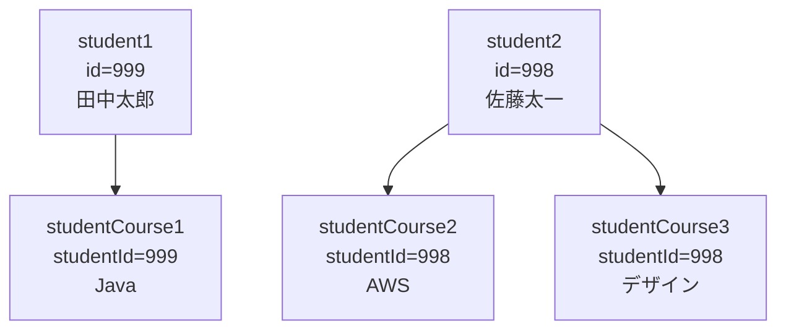

```mermaid
graph TD
    student1["student1<br>id=999<br>田中太郎"]
    student2["student2<br>id=998<br>佐藤太一"]
    course1["studentCourse1<br>studentId=999<br>Java"]
    course2["studentCourse2<br>studentId=998<br>AWS"]
    course3["studentCourse3<br>studentId=998<br>デザイン"]
    student1 --> course1
    student2 --> course2
    student2 --> course3
```